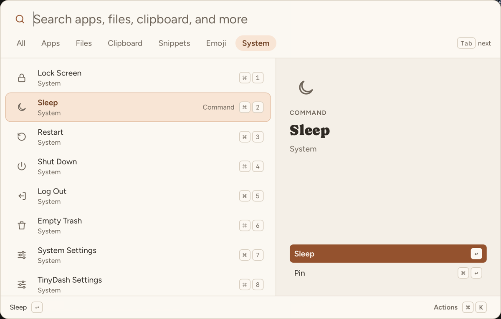

# TinyDash

A small, keyboard-first launcher for macOS, Windows, and Linux. Press a shortcut, type a few letters, and press Enter.

- **Find** apps, files, clipboard history, snippets, quicklinks, emoji, and system commands.
- **Answer** calculations, unit and currency conversions, dates, time zones, passwords, and clean URLs.
- **Stay private:** everything runs on your computer. The only download is the daily currency rate table.



## Install

Download the latest build from [Releases](https://github.com/jewei/tinydash/releases). The macOS app is signed with a Developer ID and notarized by Apple. The Windows and Linux builds are not signed: Windows SmartScreen may ask you to confirm.

Press **Control+Shift+Space** to open TinyDash. See [all features and shortcuts](docs/features.md).

## Build from source

Install Bun 1.4.2, Node.js 24, Rust (rustup), and the [Tauri prerequisites](https://v2.tauri.app/start/prerequisites/), then:

```sh
bun install
bun run dev      # run with hot reload
bun run build    # build installers for this OS
```

## Documentation

- [Features](docs/features.md): what TinyDash does and its limits.
- [Architecture](docs/architecture.md): how it works and why.
- [Development](docs/development.md): commands, tests, and releases.
- [AGENTS.md](AGENTS.md): rules for contributors, human or AI.

## License

MIT. Bundled fonts (Figtree, Caprasimo) use the SIL Open Font License; see `public/fonts`. Third-party data is listed in [`src-tauri/data/README.md`](src-tauri/data/README.md).
