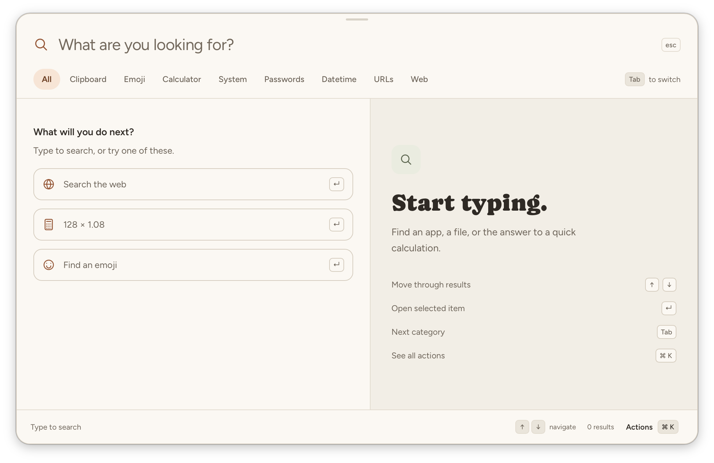

# Public release plan

Status: **Paused on 19 September 2026.** Read the
[release checkpoint](release-checkpoint.md) before resuming. TinyDash is a
small open source project with one maintainer. Exclude services that cost more
than $10 and use free services as the default. The paid signing recommendation
is withdrawn. The detailed stages below are the previous plan and need to be
reduced before further implementation. The Windows distribution route remains
open; see the [free options](windows-signing.md).

Release macOS, Windows, and Linux together. Include all three systems in both public testing and the stable launch. Use one version and source commit for each candidate. This is the agreed scope.

The first public release must let a user download, install, open, update, and remove TinyDash without developer tools. Use direct downloads as the main route. Track the results in [release verification](release-verification.md).

For v1, Mac and Windows users update through the app. Manual replacement with a new `.deb` is the supported Ubuntu update method.

## Initial support

| System  | Processor and package                      | Required desktop checks                                                                               |
| ------- | ------------------------------------------ | ----------------------------------------------------------------------------------------------------- |
| macOS   | Apple silicon; signed and notarized `.dmg` | Test each advertised macOS version. The configured minimum of macOS 12 is not proof of compatibility. |
| Windows | x64; signed NSIS `-setup.exe`              | Start with Windows 11. Test a standard user account, including a computer without WebView2.           |
| Linux   | Ubuntu 24.04 x64; `.deb`                   | Test GNOME with X11 and with Wayland. Document the Wayland shortcut setup and clipboard limits.       |

Windows 11 is the proposed first Windows target. Record the exact OS builds before publication. Advertise Ubuntu support explicitly on the Linux download button. Intel Mac, Windows ARM, other Linux distributions, and other package formats need separate verification before we add them.

The Windows installer will keep its current `downloadBootstrapper` setting. Internet access is required when WebView2 is missing. With WebView2 already installed, the downloaded TinyDash installer must work offline. State this requirement in the download page and installation instructions. An embedded offline runtime is outside v1 scope. This choice follows the [Tauri WebView2 installation options](https://v2.tauri.app/distribute/windows-installer/#webview2-installation-options).

## Current position

- The [Checks workflow](../.github/workflows/check.yml) already builds all three packages.
- The [native workflow](../.github/workflows/native.yml) tests installed Windows and Linux packages. Its Linux session uses X11.
- The [DMG check](../scripts/ci/check-dmg.sh) checks the copied Mac app and its local signature. It does not establish publisher trust or notarization.
- [Installation instructions](install.md) cover unsigned test builds and signed release candidates. Test builds expire from GitHub Actions after 14 days.
- The app has a welcome screen, local settings, and clipboard controls. Release builds have a manual updater check and install path for Mac and Windows. Ubuntu updates remain manual `.deb` installs. Start-at-login is still pending.
- Database migrations already use a transaction and have rollback tests. A local backup and recovery procedure still needs implementation and verification.
- There is no public release or configured website. GitHub reports no repository license. Choose the license and price before making related marketing claims.

These observations describe the repository on 18 September 2026. They do not establish that a public release is ready.

## Work sequence

### 1. Set the release details

The maintainer selects the version, publisher name, supported OS versions, license, and price. Keep the current tool set fixed.

Use the same version in `package.json`, `src-tauri/Cargo.toml`, and `src-tauri/tauri.conf.json`. Keep the application identifier `dev.tinydash.launcher` so upgrades retain the existing data location.

Arrange the Mac signing identity and notarization credentials. Select a Windows signing service that accepts the publisher's identity and country. Keep signing credentials in protected CI secrets. Record the publisher identity for verification.

The release maintainer owns recovery of the separate Tauri updater key. Record the custodian, public-key fingerprint, backup location, and recovery procedure. Keep an encrypted offline backup outside CI. Store its recovery password separately. Verify a restored key against the public key in the candidate installer, using a disposable update file. Never include private keys in logs or release evidence.

Record publisher-certificate expiry dates or the provider's managed renewal policy. Start manual renewal at least 30 days before expiry. Renew OS certificates without changing the updater key. Test the next signed package with the renewed certificate. Any planned updater-key change needs a tested client migration before retiring the old key.

If the updater key is lost, restore the verified backup. If recovery is impossible, existing clients need a verified manual reinstall with the replacement key. On suspected compromise, stop update publication, remove compromised access, and replace affected keys or certificates. Publish recovery instructions through a channel under restored control. Do not trust an update signed only by the compromised key to repair that trust.

Tauri explains why [losing the updater key prevents updates to existing clients](https://v2.tauri.app/plugin/updater/#signing-updates). Our backup and incident procedures are release requirements.

Completion requires verification checks S1 through S4.

### 2. Build public release packages

Add a release workflow alongside the development workflows. Build all three systems from the selected tag. Assemble the packages in one draft GitHub Release for internal verification.

Use a published GitHub prerelease for external testing. Draft downloads are not the tester distribution route. After the checks required before public testing pass, publish all three packages together with the prerelease flag. Keep the release out of the stable update feed and label the preview page as a release candidate. Check anonymous downloads before inviting testers. See [GitHub's release access rules](https://docs.github.com/en/rest/releases/releases#list-releases).

Use the intended numeric version in the app and tag from the start, for example `0.1.0` and `v0.1.0`. The GitHub prerelease flag identifies the candidate. Promotion changes that flag and release metadata only. Keep the tag, installers, signatures, and checksums unchanged. If a published candidate needs a binary change, use a new version and repeat verification.

On macOS, replace the test signing identity with a Developer ID identity. Sign, notarize, and staple the release. Follow the [Tauri Mac signing guide](https://v2.tauri.app/distribute/sign/macos/).

On Windows, sign the app and installer and include a trusted timestamp. Check the publisher on a clean consumer desktop. A valid signature does not guarantee that SmartScreen will omit its reputation warning. See [Microsoft's explanation](https://learn.microsoft.com/en-us/windows/apps/package-and-deploy/smartscreen-reputation).

On Linux, retain the current Debian package and verify its declared runtime dependencies on Ubuntu 24.04.

Include the three installers, SHA-256 checksums, version, source commit, release notes, and installation instructions. Separate public release metadata from the existing `unsigned test build` metadata. Use versioned asset URLs. Keep a published version's files unchanged.

Reuse the existing installer checks. Adapt their artifact input for release candidates. Test the signed output that users will receive. A later rebuild or signing step changes the candidate and requires new package verification.

Completion requires checks B1 through B6 and I1 through I6. B6 runs after prerelease publication and before user testing. GitHub supports [changing prerelease status without replacing assets](https://docs.github.com/en/repositories/releasing-projects-on-github/managing-releases-in-a-repository#editing-a-release).

### 3. Complete first use and updates

Keep the existing welcome screen. Show the launch shortcut and let the user run one example. Add a clipboard-history choice before the first capture on a new installation. Keep an existing user's saved choice during upgrades.

Add an optional start-at-login setting. Enabling it must start one TinyDash process after login. Disabling it must remove that startup registration.

Add an update command and an update notice for direct Mac and Windows installations. Let the user choose when to install and restart. Use Tauri's update signatures as well as the OS publisher signatures. They serve different checks.

Use signed update packages on GitHub Releases and a static update manifest. Keep test and stable update feeds separate. Set `TINYDASH_UPDATE_ENDPOINT` to the intended feed at build time. Promotion must not require a new build or signature. The released app must default to the stable feed. A higher version in a public prerelease must not enter that feed automatically. Tauri supports this [static update setup](https://v2.tauri.app/plugin/updater/).

For Ubuntu v1, instruct users to quit TinyDash, install the new `.deb` with APT, and reopen the app. This manual replacement is the supported update procedure. It must preserve settings and data, with one package registration, desktop entry, startup entry if enabled, and resident process. Installing a local `.deb` does not create an APT update repository. Tauri's Linux updater uses AppImage. Add an APT repository later if users need it.

Before a data migration, pause writes and save a consistent local backup of the database and settings. Record the app and schema versions. Verify that the backup can be read before changing the data. If backup creation fails, stop the migration and show a recovery message.

Keep migrations transactional. A failed migration must retain the prior schema, data, and clipboard-history choice. Preserve an unreadable or newer database and report the problem. Do not replace it with an empty database. The existing [migration tests](../src-tauri/src/db/migrations.rs) cover part of this behavior. Add installed-app tests for interruption and recovery.

Keep one verified backup from before the most recent migration, with access limited to its owner. Replace it only after the next backup succeeds. Keep it on the device. Removal instructions must cover backups because they can contain saved clipboard text. Restoration requires an explicit user choice and an app version compatible with the backup's schema. Preserve the current files before restoration and explain that later changes will not be in the backup.

For every release after v1, test the previous public version upgrading to the candidate on all three systems. For v1, use an earlier signed test version. Test interrupted downloads, interrupted installation, failed migrations, low disk space, and backup restoration. Test that recovery leaves one usable installation and retains saved preferences. Prefer a fixed newer app over an automatic binary downgrade.

Completion requires checks F1 through F4 and U1 through U6.

### 4. Create the download page

Add a small static website in `site/`. Keep it outside the desktop application's build output. GitHub Pages is the initial hosting proposal. A custom domain can follow.

Use this message:

> Find apps, files, and copied text on macOS, Windows, and Linux.

Show a main download button for the detected system. Always show all three downloads. Display the supported processor, OS version, package type, app version, and download size. Do not infer Mac processor support from the browser's OS label. Mobile and unknown systems must show the download list without starting a download.

Include installation steps, update steps, removal steps, release notes, and a support link. Put download instructions above developer setup in the README once the release is public. Users must be able to download without a GitHub account.

Use the supplied screenshot as the first visual reference. Reuse the app's cream background, peach selection color, and existing fonts. Add a short recording that opens an app, finds sample clipboard text, and converts a value. Record each advertised desktop separately.

This is the user's Mac screenshot, copied without changes. It shows the welcome screen. Apps and Files tabs are absent in this image; category visibility is configurable. Use the default categories for the main feature demonstration. This image does not verify Windows or Linux behavior.

Describe network use accurately. File and clipboard searches run locally. Currency updates download rates, web search opens an external service, and the manual updater check downloads release data when configured. Explain that saved clipboard history is local plain text. Use sample data in promotional images.

Completion requires checks W1 through W5.

### 5. Test with users and promote the release

Recruit five test users per system for the initial usability check. Give them the preview page and direct downloads from the published prerelease. These links need no GitHub account. Keep the candidate out of the stable update feed. Ask users to install TinyDash, open it with a shortcut, complete a search, and remove it without live help.

Require at least four of the five users on each system to complete these tasks without help. This small first-use check does not establish a general success rate. Record all attempts, including additional testers and failed attempts. Repeat affected checks after a fix.

An unresolved data-loss, removal, signing/trust, or launch failure blocks the stable release regardless of the user count. An expected SmartScreen reputation warning is a separate observation; an invalid signature, unexpected publisher, or policy block is a failure. All required technical checks must pass.

After candidate verification and user testing, promote the same GitHub prerelease to stable and mark it as latest. Download every installer without authentication and compare its checksum with the tested candidate. Then promote the website downloads and stable update manifest. Announce the release only after these checks pass for all three systems. Promotion must not rebuild or sign the files again.

If one system fails, hold stable promotion for all three systems. Keep the last working stable release available. Fix a published defect with a new version. Do not replace published binaries or force users to downgrade their database.

Completion requires checks P1 through P3 and L1 through L3.

### 6. Add installation channels and marketing

Create a Homebrew tap under the maintainer's account. Submit a WinGet package that points to the same tested Windows installer. Use versioned URLs and correct checksums. These channels do not delay the combined direct-download release. See [Homebrew taps](https://docs.brew.sh/How-to-Create-and-Maintain-a-Tap) and [WinGet submissions](https://learn.microsoft.com/en-us/windows/package-manager/package/repository).

Publish each package-manager command only after a clean-machine installation succeeds. Define whether the app or package manager handles updates, and test that choice. The proposed Homebrew command is `brew install --cask jewei/tap/tinydash`; it is not available yet.

Start with keyboard users and developer communities. Prepare a short demo, three platform screenshots, installation links, and release notes. Use one download page for every announcement. Post to Show HN after the app is available to try. Follow each community's posting rules.

For the pilot, record page-to-install problems, time to first successful action, and whether users still use TinyDash after seven days. Ask testers directly. Do not collect their queries, clipboard text, or file paths. Download counts alone do not measure active users.

App stores and wider Linux packaging follow later. The current Mac transparency uses private APIs, which [Tauri identifies as incompatible with Mac App Store acceptance](https://v2.tauri.app/reference/config/#transparent).

Completion for each additional installation channel requires checks C1 and C2.

## Immediate implementation order

Set the release details and resolve the Windows test failure recorded in verification. Then prepare the signed release workflow. Build first-use controls and updates against candidate packages. The download page can proceed while signing is arranged. Finish with desktop verification, user testing, and one combined release.

Read the [verification record](release-verification.md) with this plan. It defines the checks required before a public prerelease, before stable promotion, and before the announcement. It also contains current repository evidence and a template for each test result.
